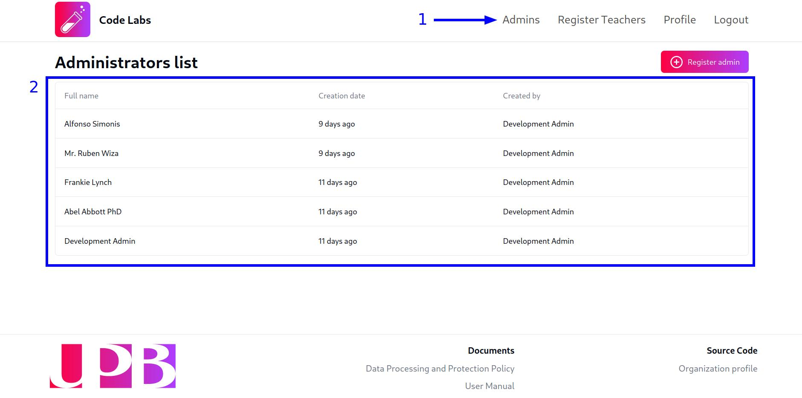
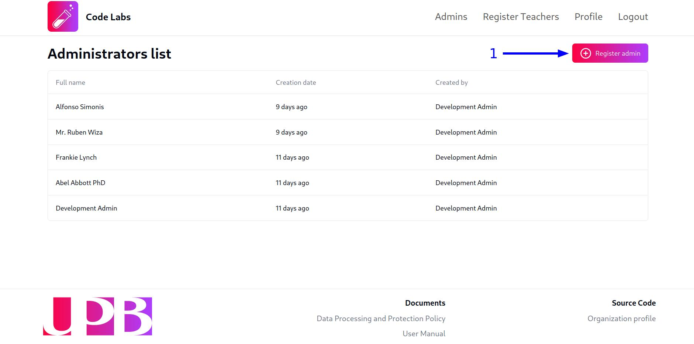
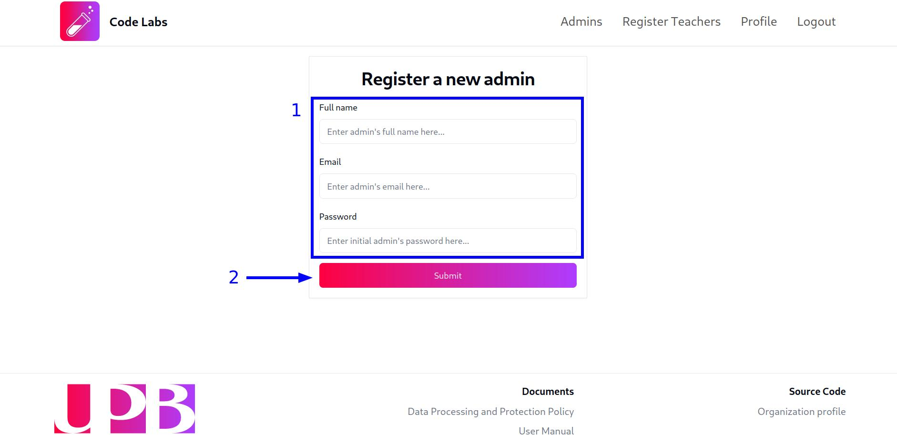

En la plataforma Code Labs, los usuarios con rol de administrador **NO** son super-usuarios. Las funcionalidades de los administradores se limitan al monitoreo y creación de cuentas de cuentas para nuevos administradores así como la creación de cuentas de profesores.

## Ver cuentas de administradores

Una vez hayas iniciado sesión en la plataforma, serás redirigido a la vista que contiene la lista de cuentas de administradores activas en el sistema. Esta vista incluye el nombre fecha de creación y responsable de la creación de cada cuenta. En caso de que no seas redirigido a esta vista, puedes acceder a ella haciendo clic en la opción `Admins` del menú de navegación que se encuentra en la parte superior de la pantalla:

## Crear una nueva cuenta de administrador

Para crear una nueva cuenta de administrador, sigue estos pasos:

1. Haz clic en el botón `Register admin` que se encuentra en la parte superior derecha de la vista de la lista de cuentas de administradores:

2. Una vez hayas hecho clic en el botón, serás redirigido a una vista que contiene un formulario con los campos `Full name`, `Email` y `Password`. Ingresa la información correspondiente a la nueva cuenta de administrador en los campos del formulario y haz clic en el botón `Submit` para crear la cuenta:

:::caution
Es importante que asignes una contraseña segura a la nueva cuenta de administrador y recuerda que **es responsabilidad de cada administrador cambiar la contraseña que se le asignó por defecto**.
:::

## Editar una cuenta de administrador

En la plataforma, **NO** es posible que un administrador modifique la información de otra cuenta. Cada usuario tiene la posibilidad y responsabilidad de actualizar la información de su propia cuenta y su contraseña. Para ello, sigue los pasos descritos en la [guía de gestión de cuentas de usuario](/manual/guides/users/profile-management).

## Eliminar una cuenta de administrador

En la plataforma, **NO** es posible que un administrador elimine la cuenta de otro administrador o usuario.

Más sin embargo, si un administrador detecta otra cuenta con el rol de administrador no autorizada, debe reportar el incidente a los mantenedores de la plataforma o al responsable de la administración de la base de datos para que se tomen las medidas correspondientes.
