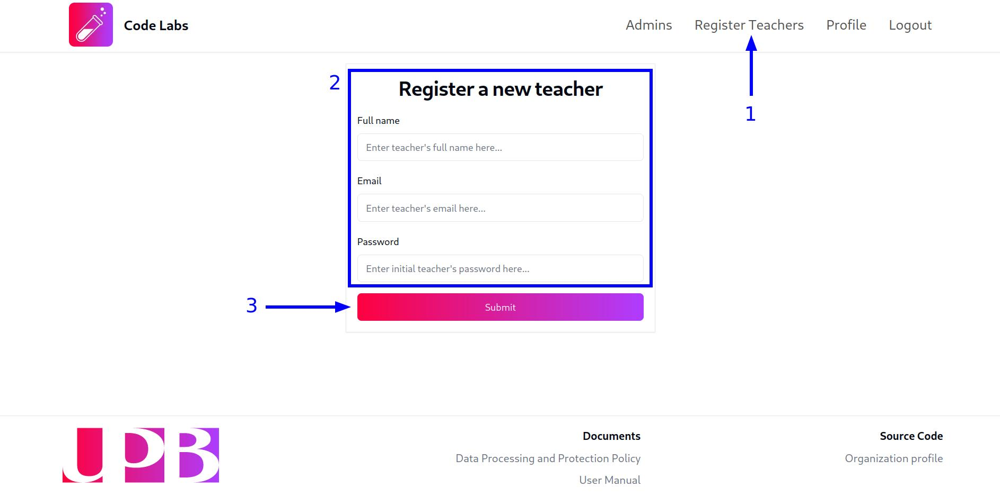

## Crear una nueva cuenta de profesor

Para crear una nueva cuenta de profesor, haz clic en la opción `Register teachers` del menú de navegación que se encuentra en la parte superior de la pantalla para acceder al formulario de registro de profesores. Una vez en la vista del formulario, ingresa la información correspondiente a la nueva cuenta de profesor en los campos `Full name`, `Email` y `Password` y haz clic en el botón `Submit` para crear la cuenta:

:::caution
Es importante que asignes una contraseña segura a la nueva cuenta de profesor y recuerda que **es responsabilidad de cada profesor cambiar la contraseña que se le asignó por defecto**.
:::

## Editar una cuenta de profesor

En la plataforma, **NO** es posible que un administrador modifique la información de otra cuenta. Cada usuario tiene la posibilidad y responsabilidad de actualizar la información de su propia cuenta y su contraseña. Para ello, sigue los pasos descritos en la [guía de gestión de cuentas de usuario](/guides/users/profile-management).

## Eliminar una cuenta de profesor

En la plataforma, **NO** es posible que un administrador elimine la cuenta de otro profesor o usuario.

Es responsabilidad de los mantenedores de la plataforma o del responsable de la administración de la base de datos verificar la existencia de cuentas con el rol de profesor no autorizadas y tomar las medidas correspondientes.
