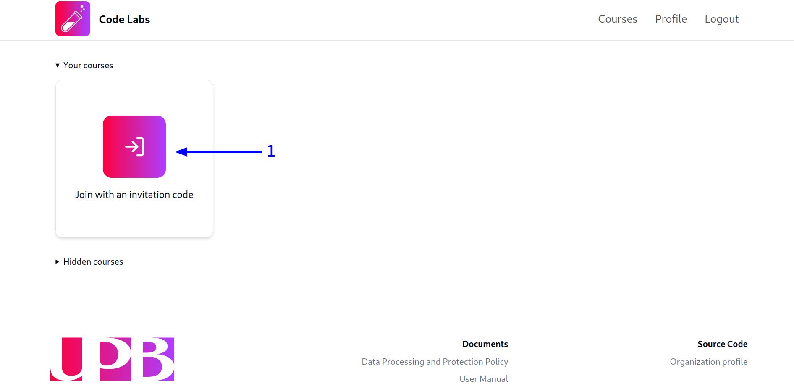
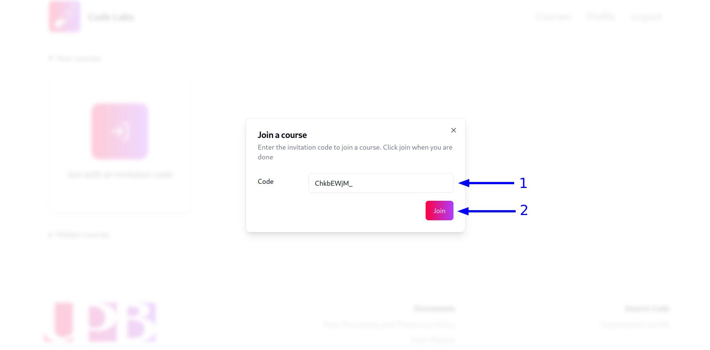

## Ingresar a un curso

Los estudiantes pueden ser agregados manualmente a un curso por el profesor o pueden ingresar a un curso utilizando un código de invitación. Si el profesor ha compartido el código de invitación del curso, sigue estos pasos para ingresar al curso:

1. Haz clic en el botón `Join with an invitation code` en la vista de cursos:

2. Ingresa el código de invitación del curso en el modal y haz clic en el botón `Join`:

Después de eso, aparecerá una notificación verde en la esquina inferior derecha de la pantalla, confirmando que te has unido al curso correctamente y aparecerá una tarjeta con las iniciales y el nombre del curso en la vista de cursos.

## Cambiar la visibilidad de un curso

Si deseas ocultar o mostrar un curso en la vista de cursos, sigue los pasos descritos en la sección [Cambiar la visibilidad de un curso](/guides/teachers/courses-management#cambiar-la-visibilidad-de-un-curso) de la guía para profesores.
