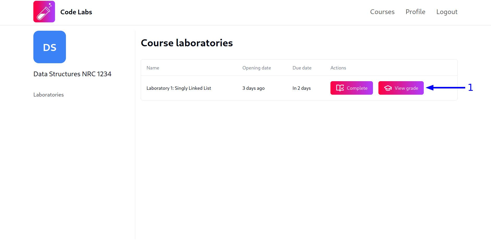
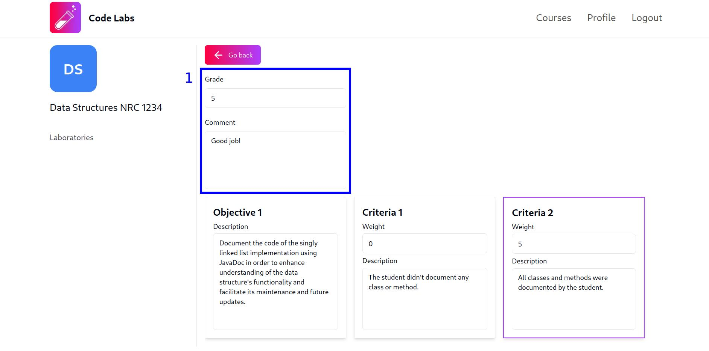
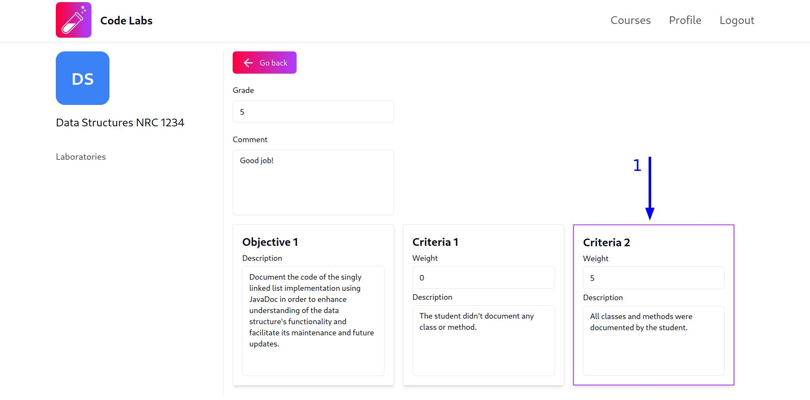

## Ver notas

Para ver la nota que has obtenido en uno de los laboratorios de un curso, sigue estos pasos:

1. Haz clic en el botón `View grade` en la fila del laboratorio del que deseas ver la nota. Recuerda que, para ver la tabla de laboratorios, debes acceder a la vista del curso haciendo clic en la tarjeta del curso, tal como se explica en la [guía de gestión de laboratorios](/manual/guides/students/laboratories-management#ver-contenido-de-un-laboratorio):

2. Luego de hacer clic en el botón mencionado, serás redirigido a la vista de la nota del laboratorio. En esta vista, podrás ver, en primer lugar, un formulario con la nota obtenida y un campo con los comentarios adicionales que el profesor haya dejado para ti:

También podrás ver la rúbrica utilizada por el profesor para evaluar el laboratorio. Los criterios resaltados con un borde de color morado son aquellos que el profesor ha seleccionado para evaluar tu laboratorio y, por tanto, a partir de los cuales se ha calculado tu nota (Es posible que tengas que desplazarte hacia la derecha para ver todos los criterios en caso de que los objetivos del laboratorio tengan varios criterios):

Si no hay ningún criterio resaltado con un borde de color morado, significa que el profesor aún no ha evaluado tu laboratorio dentro de la plataforma. En Code Labs, **NO** es posible que los profesores asignen calificaciones directamente a los estudiantes sin utilizar la rúbrica asociada al laboratorio, esto para favorecer la transparencia en la evaluación.

:::note
En cualquier momento, incluso si no has sido calificado o no has completado el laboratorio, podrás ingresar a la vista de calificación para ver la rúbrica utilizada por el profesor y conocer los criterios con los que serás evaluado.
:::
