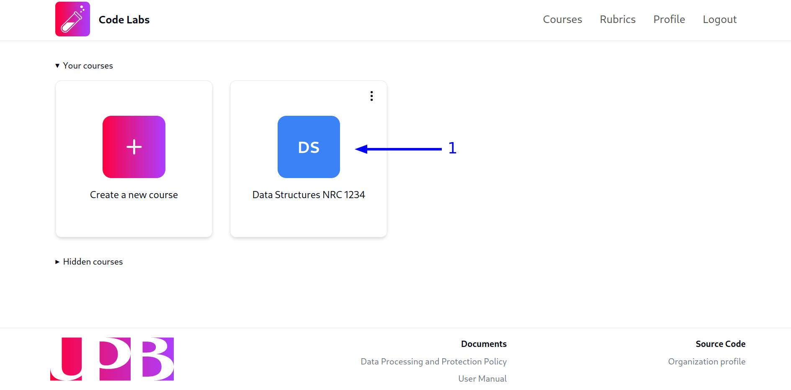
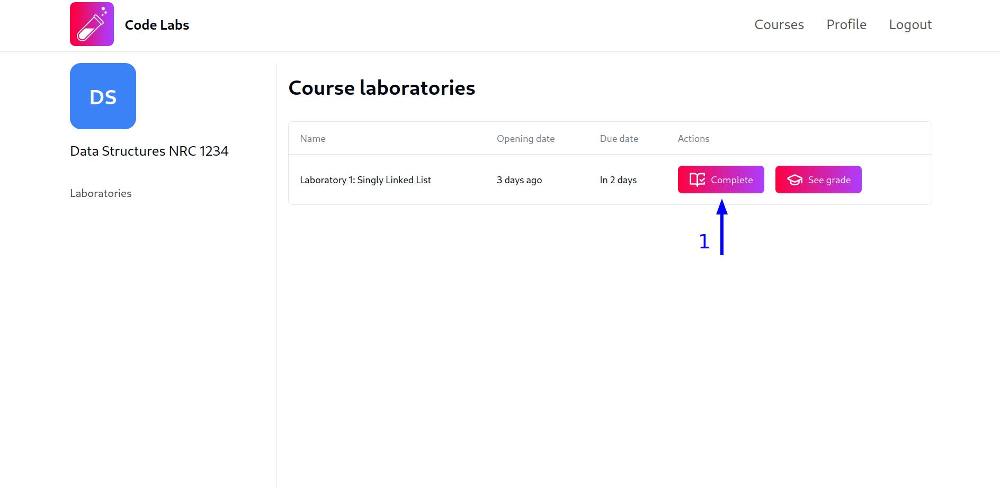
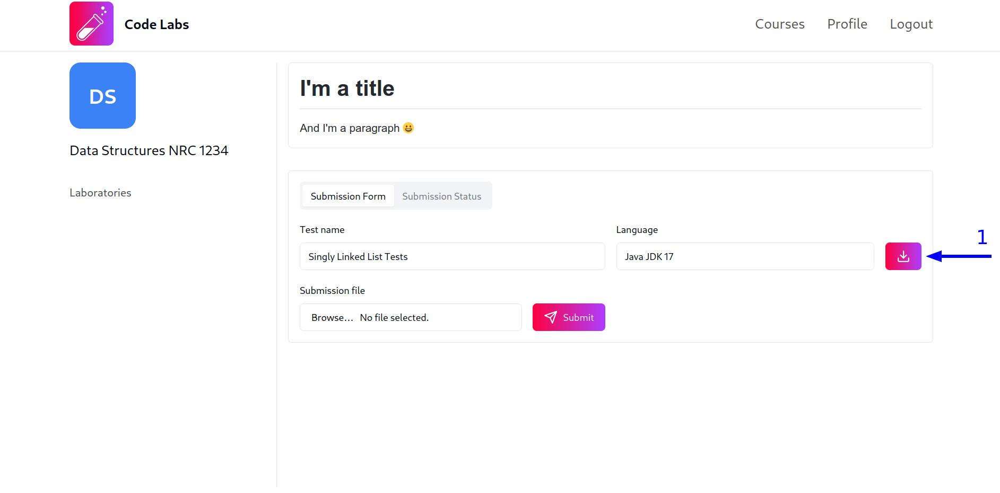
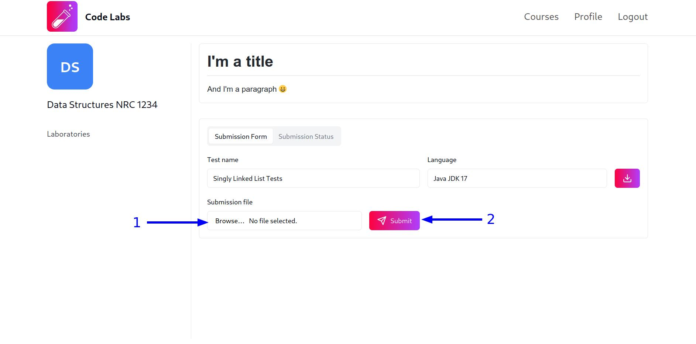
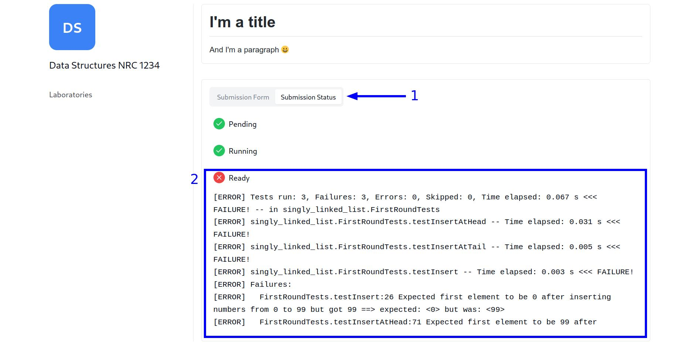
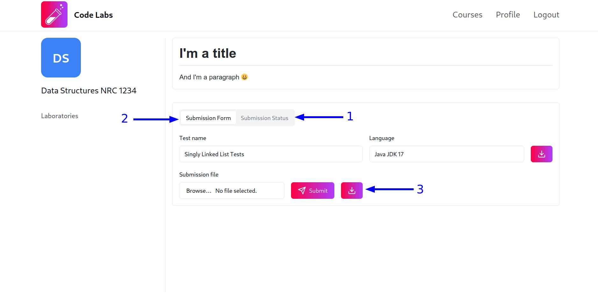

## Ver contenido de un laboratorio

Para ver el contenido de un laboratorio, sigue estos pasos:

1. Ingresa a la vista del curso en el que deseas crear el laboratorio haciendo clic en la tarjeta del curso:

2. Haz clic en el botón `Complete` en la fila del laboratorio que deseas ver:

Una vez que hayas completado estos pasos, serás redirigido a la vista del laboratorio y podrás ver las instrucciones y las pruebas unitarias preparadas por el profesor.

:::note
Incluso si ya has completado el laboratorio, o si la fecha de cierre ha pasado, podrás seguir **viendo** el contenido del laboratorio.
:::

## Completar un laboratorio

Antes de aprender a completar un laboratorio, debes saber que un laboratorio está compuesto por un conjunto de instrucciones escritas por el profesor en `MarkDown` a través de `Text Blocks` y un conjunto de pruebas unitarias para que deberás completar a través de `Test Blocks`.

### Enviar código a través de los `Test Blocks`

Para enviar tu código a través de los bloques de pruebas, sigue estos pasos:

1. Descarga el `template` del lenguaje de programación seleccionado por el profesor haciendo click en el botón con el icono de descarga:

**DEBES** utilizar el `template` proporcionado por la plataforma para escribir tu código ya que **NO** podemos garantizar que las pruebas escritas por el profesor funcionarán si usas una estructura de carpetas, librerías o cualquier otra cosa que no esté soportada por nuestro template.

Cuando descomprimas el archivo `zip` descargado, podrás abrir el proyecto en tu IDE favorito y escribir tu código. Para conocer más sobre la estructura de carpetas del `template`, te recomendamos que leas la sección de [consideraciones especiales para enviar soluciones en los lenguajes soportados](#consideraciones-especiales-para-los-lenguajes-soportados).

2. Una vez que hayas escrito tu código siguiendo las instrucciones del profesor, crea un archivo `zip` con tu código, selecciónalo desde el bloque de pruebas y envíalo haciendo clic en el botón `Submit`:

3. Al enviar tu solución, el bloque de pruebas mostrará, en "tiempo real", el estado de tu solución. Al finalizar la ejecución de las pruebas, podrás ver el veredicto de las pruebas y el output obtenido, de modo que podrás realizar las correcciones necesarias y volver a enviar tu solución si es necesario:

:::note
El nivel de detalle del output obtenido dependerá, en gran medida, de los mensajes que haya escrito el profesor en las pruebas. Si tienes dudas sobre el output obtenido, te recomendamos que te comuniques con el profesor.
:::

4. En cualquier momento puedes ver el estado de tu solución haciendo clic en la pestaña `Submission Status` del bloque de pruebas. Y en cualquier momento puedes regresar a la vista por defecto del bloque de pruebas haciendo clic en la pestaña `Submission Form`. Una vez realices un envío, desde la pestaña `Submission Form` podrás descargar el archivo `zip` que enviaste haciendo clic en el botón con el icono de descarga:

:::note
Una vez se alcance la fecha de cierre del laboratorio, seguirás pudiendo ver el contenido del laboratorio y el estado de tus soluciones, pero **NO** podrás enviar nuevas soluciones.
:::

#### Consideraciones especiales para los lenguajes soportados

Por favor, lee las guías específicas para cada lenguaje soportado para conocer más sobre las consideraciones específicas que debes tener en cuenta al enviar tu solución en cada lenguaje:

- [JAVA](/guides/students/languages-specific-considerations/java/)
