## Crear un nuevo curso

Una vez que hayas iniciado sesión en la plataforma, serás redirigido a la vista de los cursos que has creado. Para crear un nuevo curso, sigue estos pasos:

1. Haz clic en el botón `Create a new course`:

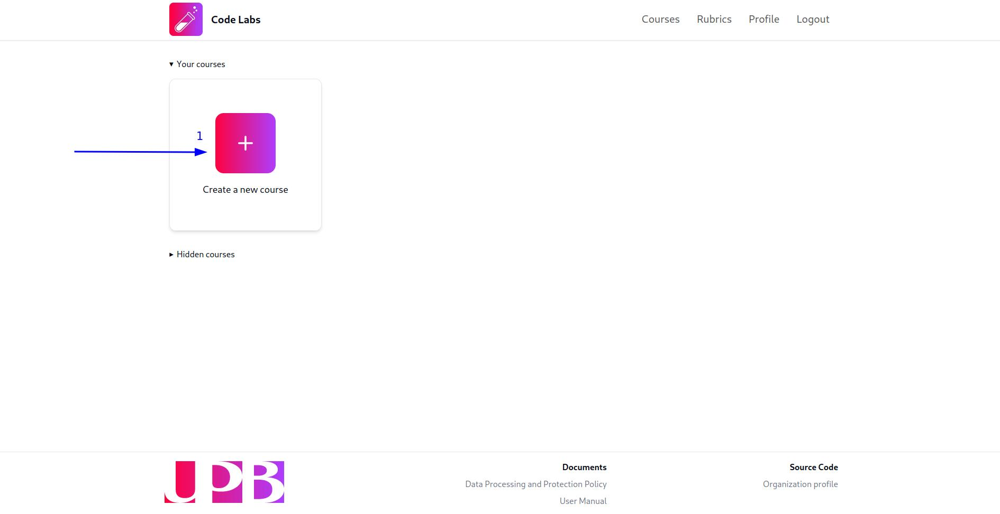

2. Ingresa el nombre del curso en el modal. Te sugerimos que uses un nombre lo suficientemente descriptivo para que tus estudiantes puedan identificar fácilmente el curso, un buen ejemplo sería `Estructuras de datos NRC 1234`. Una vez que hayas ingresado el nombre, haz clic en el botón `Create`:

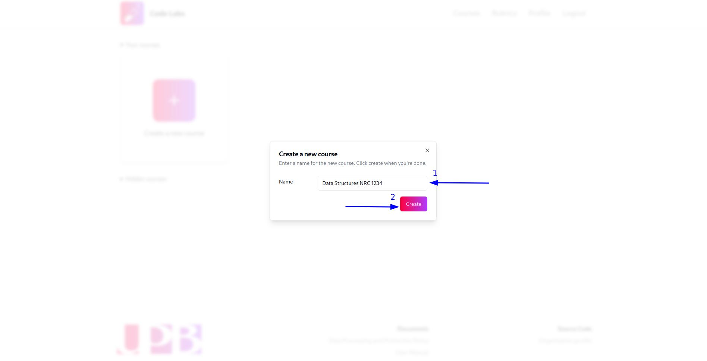

Una vez que hayas creado el curso, aparecerá una notificación verde en la esquina inferior derecha de la pantalla, confirmando que el curso se ha creado correctamente y aparecerá una tarjeta con las iniciales y el nombre del curso en la vista de cursos.

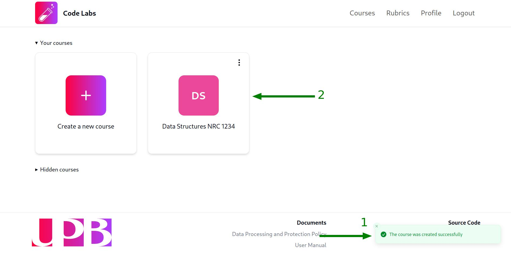

:::note
Se asignará un color aleatorio al curso, no podrás cambiarlo ya que es una característica puramente estética.
:::

## Renombrar un curso

Para renombrar un curso, sigue estos pasos:

1. Haz clic en el menú desplegable del curso que deseas renombrar (los tres puntos en la esquina superior derecha de la tarjeta del curso) y selecciona la opción cone el texto `Rename course`:

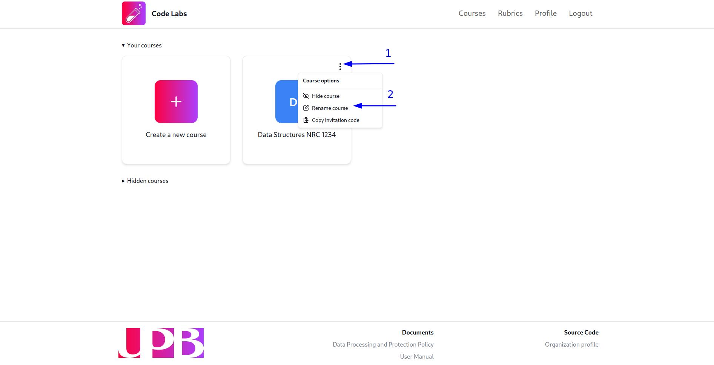

2. Completa el modal con el nuevo nombre del curso y haz clic en el botón `Rename`:

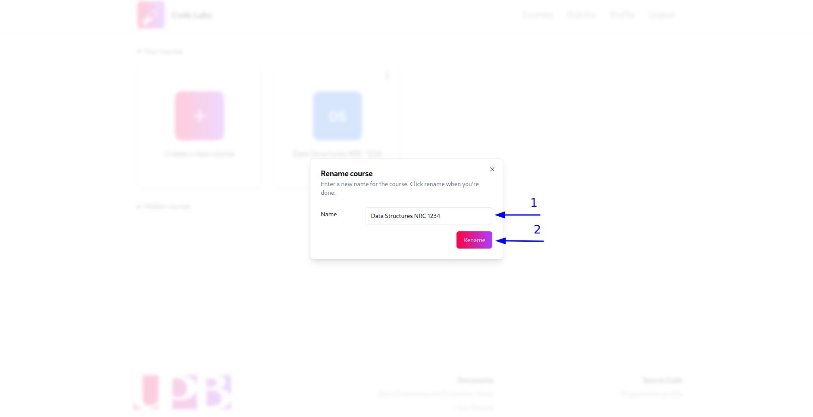

Después de eso, aparecerá una notificación verde en la esquina inferior derecha de la pantalla, confirmando que el curso se ha renombrado correctamente y la tarjeta del curso se actualizará con el nuevo nombre.

## Cambiar la visibilidad de un curso

### Ocultar un curso

:::note
Ocultar un curso no lo eliminará ni evitará que los estudiantes accedan a él, solo lo ocultará de la vista de cursos para permitirte organizar mejor tus cursos.
:::

Para ocultar un curso, haz clic en el menú desplegable del curso que deseas ocultar (los tres puntos en la esquina superior derecha de la tarjeta del curso) y selecciona la opción cone el texto `Hide course`:

Después de eso, aparecerá una notificación verde en la esquina inferior derecha de la pantalla, confirmando que el curso se ha ocultado correctamente y la tarjeta del curso desaparecerá de la sección de cursos visibles.

### Mostrar un curso oculto

Si deseas mostrar el curso nuevamente, puedes hacerlo haciendo clic en la sección `Hidden courses` para mostrar los cursos ocultos y luego seleccionando la opción `Show course` del menú desplegable del curso que deseas mostrar:

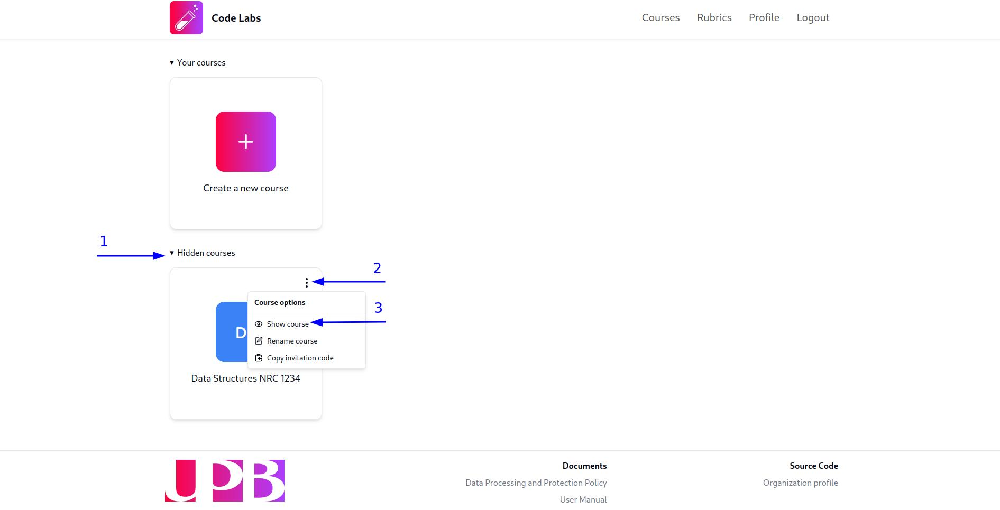

## Copiar el código de invitación de un curso

Cuando creas un nuevo curso, se genera automáticamente un código de invitación para permitir que los estudiantes se unan al curso. Para copiar el código de invitación de un curso, haz clic en el menú desplegable del curso del que deseas copiar el código de invitación (los tres puntos en la esquina superior derecha de la tarjeta del curso) y selecciona la opción con el texto `Copy invitation code`:

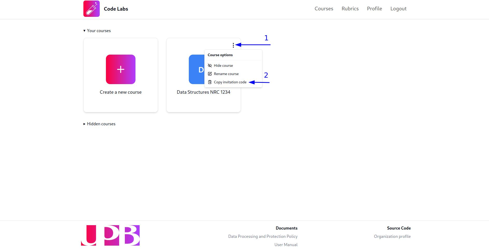

Después de eso, aparecerá una notificación verde en la esquina inferior derecha de la pantalla, confirmando que el código de invitación se ha copiado al portapapeles y podrás pegarlo donde lo necesites presionando `Ctrl + V` o `Cmd + V` en tu teclado o haciendo clic derecho y seleccionando la opción `Pegar`, como lo harías con cualquier otro texto copiado.

:::note
Los códigos de invitación pueden expirar de acuerdo a la configuración realizada por el administrador de la plataforma. Si el código de invitación ha expirado, un nuevo código de invitación será generado automáticamente al copiarlo siguiendo los pasos descritos anteriormente.
:::

## Gestionar participantes

### Añadir un estudiante a un curso

Los estudiantes pueden unirse a un curso utilizando el código de invitación que se genera automáticamente al crear un nuevo curso, sin embargo, si deseas añadir manualmente a un estudiante a un curso, sigue estos pasos:

1. Ingresa a la vista del curso al que deseas añadir al estudiante haciendo clic en la tarjeta del curso:

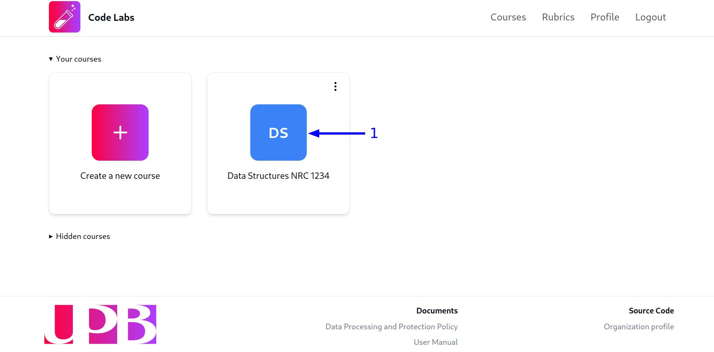

2. Por defecto, serás redirigido a la pestaña `Laboratories` de la vista del curso. Para cambiar a la pestaña de participantes, haz click en la opción `Manage participants` en la barra lateral de la vista del curso para acceder a la tabla de estudiantes inscritos en el curso:

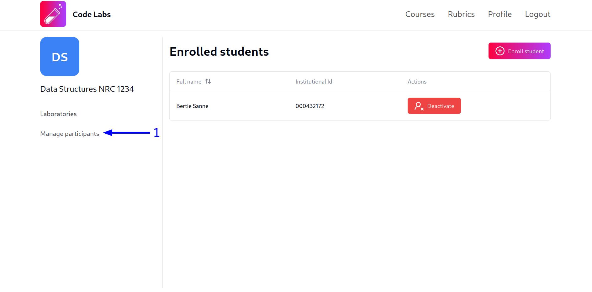

3. Haz clic en el botón `Enroll student`:

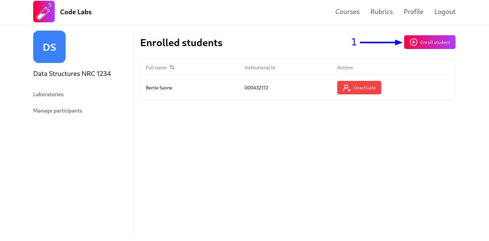

4. Ingresa el nombre del estudiante en el modal para buscarlo y haz clic en estudiante que deseas agregar en la lista de resultados. Para mayor facilidad, en la lista de resultados se mostrará el nombre completo y el ID institucional del estudiante:

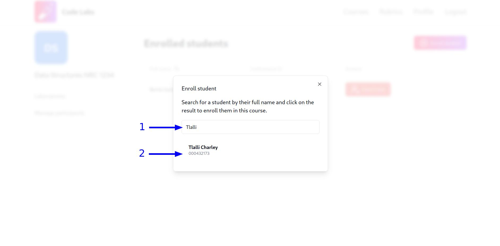

Después de eso, aparecerá una notificación verde en la esquina inferior derecha de la pantalla, confirmando que el estudiante se ha añadido correctamente al curso y la tabla de estudiantes se actualizará con el nuevo estudiante.

### Desactivar la participación de un estudiante en un curso

Es posible desactivar la participación de un estudiante en un curso, lo cual evitará que el estudiante pueda acceder al curso y su contenido. Para desactivar la participación de un estudiante en un curso, sigue estos pasos:

1. Ingresa a la vista de participantes del curso al que deseas desactivar la participación del estudiante siguiendo los pasos 1 y 2 de la sección [Añadir un estudiante a un curso](#añadir-un-estudiante-a-un-curso).

2. Haz clic en el botón `Deactivate` de la fila correspondiente al estudiante que deseas desactivar:

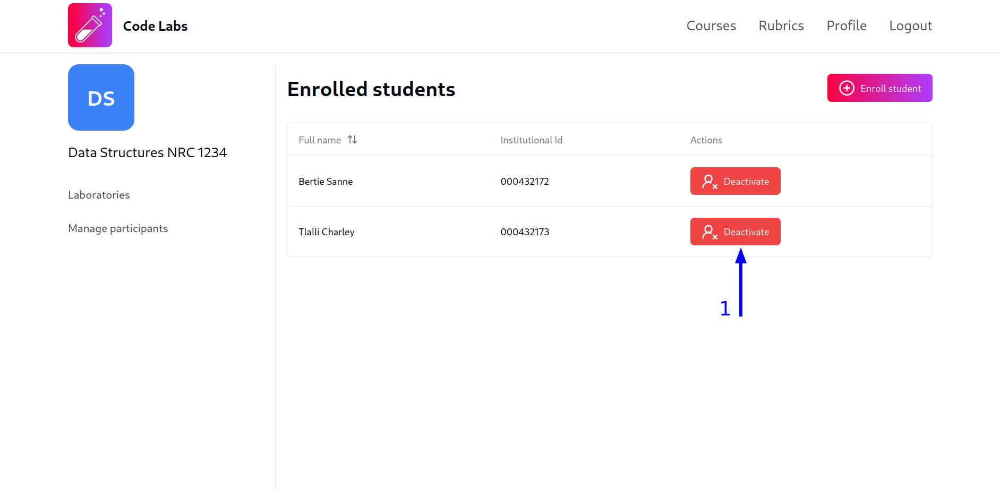

Después de eso, aparecerá una notificación verde en la esquina inferior derecha de la pantalla, confirmando que el estudiante se ha desactivado correctamente el botón `Deactivate` se cambiará por el botón `Activate`.

### Activar la participación de un estudiante en un curso

Si deseas que un estudiante vuelva a tener acceso al curso y su contenido, puedes activar su participación siguiendo estos pasos:

1. Ingresa a la vista de participantes del curso al que deseas activar la participación del estudiante siguiendo los pasos 1 y 2 de la sección [Añadir un estudiante a un curso](#añadir-un-estudiante-a-un-curso).

2. Haz clic en el botón `Activate` de la fila correspondiente al estudiante que deseas activar:

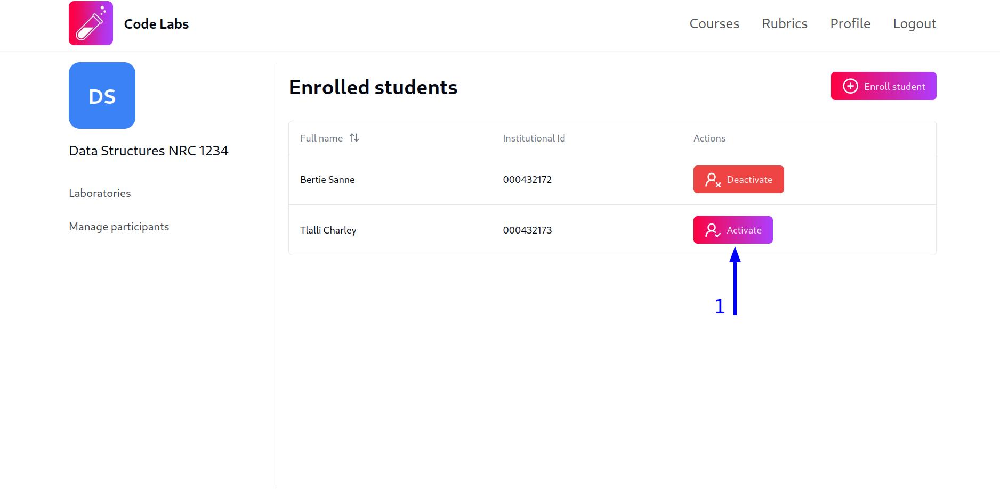

Después de eso, aparecerá una notificación verde en la esquina inferior derecha de la pantalla, confirmando que el estudiante se ha activado correctamente y el botón `Activate` se cambiará por el botón `Deactivate`.
