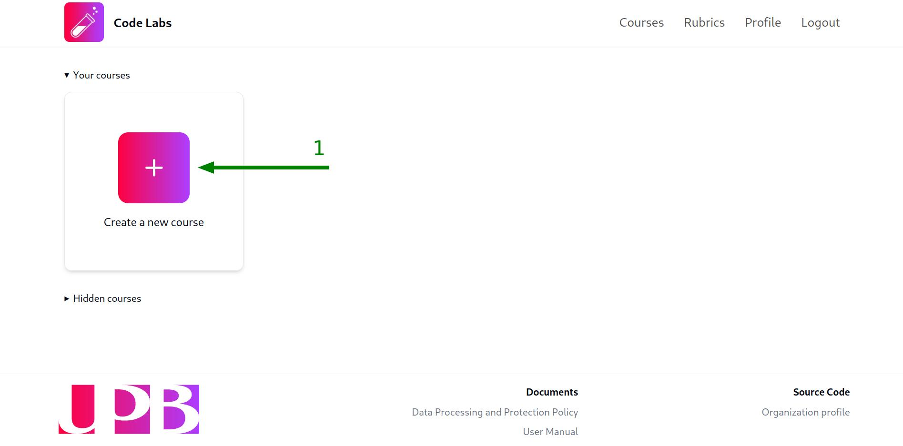
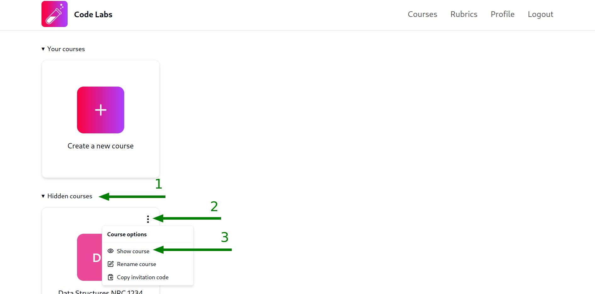

## Crear un nuevo curso

Una vez que hayas iniciado sesión en la plataforma, serás redirigido a la vista de los cursos que has creado. Para crear un nuevo curso, sigue estos pasos:

1. Haz clic en el botón `Create a new course`:

2. Ingresa el nombre del curso en el modal. Te sugerimos que uses un nombre lo suficientemente descriptivo para que tus estudiantes puedan identificar fácilmente el curso, un buen ejemplo sería `Estructuras de datos NRC 1234`. Una vez que hayas ingresado el nombre, haz clic en el botón `Create`:

Una vez que hayas creado el curso, aparecerá una notificación verde en la esquina inferior derecha de la pantalla, confirmando que el curso se ha creado correctamente y aparecerá una tarjeta con las iniciales y el nombre del curso en la vista de cursos.

:::note
Se asignará un color aleatorio al curso, no podrás cambiarlo ya que es una característica puramente estética.
:::

## Renombrar un curso

Para renombrar un curso, sigue estos pasos:

1. Haz clic en el menú desplegable del curso que deseas renombrar (los tres puntos en la esquina superior derecha de la tarjeta del curso) y selecciona la opción cone el texto `Rename course`:

2. Completa el modal con el nuevo nombre del curso y haz clic en el botón `Rename`:

Después de eso, aparecerá una notificación verde en la esquina inferior derecha de la pantalla, confirmando que el curso se ha renombrado correctamente y la tarjeta del curso se actualizará con el nuevo nombre.

## Cambiar la visibilidad de un curso

### Ocultar un curso

:::note
Ocultar un curso no lo eliminará ni evitará que los estudiantes accedan a él, solo lo ocultará de la vista de cursos para permitirte organizar mejor tus cursos.
:::

Para ocultar un curso, haz clic en el menú desplegable del curso que deseas ocultar (los tres puntos en la esquina superior derecha de la tarjeta del curso) y selecciona la opción cone el texto `Hide course`:

Después de eso, aparecerá una notificación verde en la esquina inferior derecha de la pantalla, confirmando que el curso se ha ocultado correctamente y la tarjeta del curso desaparecerá de la sección de cursos visibles.

### Mostrar un curso oculto

Si deseas mostrar el curso nuevamente, puedes hacerlo haciendo clic en la sección `Hidden courses` para mostrar los cursos ocultos y luego seleccionando la opción `Show course` del menú desplegable del curso que deseas mostrar:

## Copiar el código de invitación de un curso

Cuando creas un nuevo curso, se genera automáticamente un código de invitación para permitir que los estudiantes se unan al curso. Para copiar el código de invitación de un curso, haz clic en el menú desplegable del curso del que deseas copiar el código de invitación (los tres puntos en la esquina superior derecha de la tarjeta del curso) y selecciona la opción con el texto `Copy invitation code`:

Después de eso, aparecerá una notificación verde en la esquina inferior derecha de la pantalla, confirmando que el código de invitación se ha copiado al portapapeles y podrás pegarlo donde lo necesites presionando `Ctrl + V` o `Cmd + V` en tu teclado o haciendo clic derecho y seleccionando la opción `Pegar`, como lo harías con cualquier otro texto copiado.
