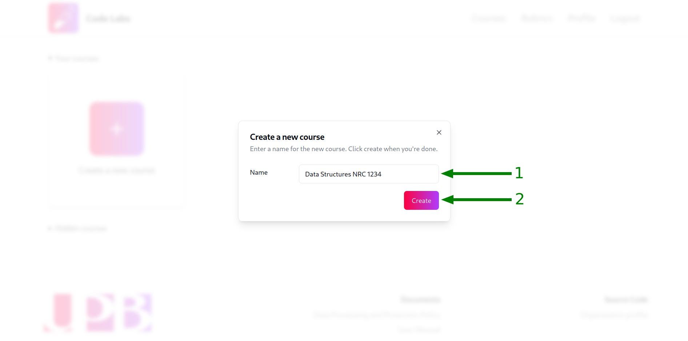
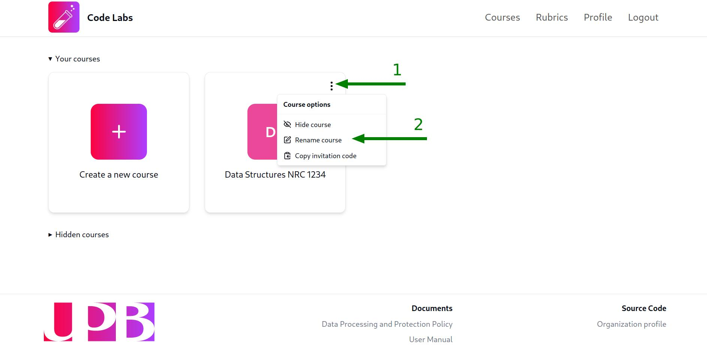
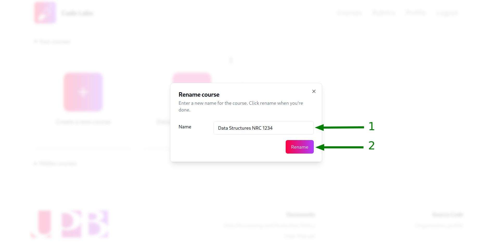
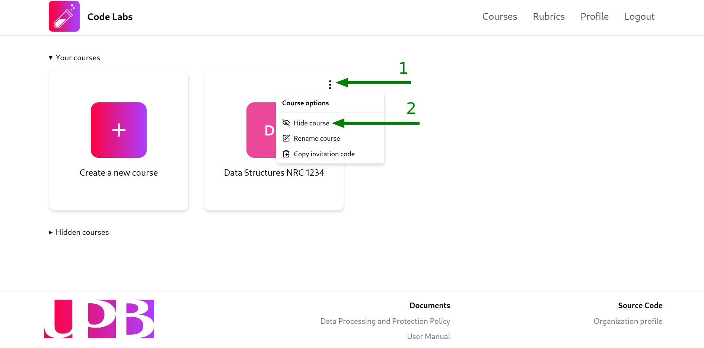

## Create a new course

Once you have logged in to the platform, you will be redirected to the view of the courses you've created. To create a new course, follow these steps:

1. Click on the `Create a new course` button:

2. Fill in the modal with the course's name. We suggest you to use a descriptive enough name so that your students can easily identify the course, a good example would be `Data Structures NRC 1234`. Once you have filled in the name, click on the `Create` button:

:::note
You can change the course's name later on if you need to.
:::

Once you have created the course, a green notification will appear at the right-bottom corner of the screen, confirming that the course has been created successfully and a card with the course's initials and name will appear in the courses view:

:::note
A random color will be assigned to the course, you cannot change it since it is a purely aesthetic feature.
:::

## Rename a course

To rename a course, follow these steps:

1. Click on the dropdown menu of the course you want to rename (the three dots at the top-right corner of the course's card) and select the option with the `Rename course` label:

2. Fill in the modal with the new name of the course and click on the `Rename` button:

After that, a green notification will appear at the right-bottom corner of the screen, confirming that the course has been renamed successfully and the course's card will be updated with the new name.

## Change visibility of a course

### Hide a course

:::note
Hiding a course wont delete it nor prevent students from accessing it, it will only hide it from the courses view to keep it organized.
:::

To hide a course, click on the dropdown menu of the course you want to hide (the three dots at the top-right corner of the course's card) and select the option with the `Hide course` label:

After that, a green notification will appear at the right-bottom corner of the screen, confirming that the course has been hidden successfully and the course's card will disappear from the visible courses section.

### Show a hidden course

If you want to show the course again, you can do it by clicking on the `Hidden courses` toggle below the visible courses cards and then clicking on the dropdown menu of the course you want to show and selecting the option with the `Show course` label.

## Copy the invitation code of a course

When you create a new course, an invitation code is generated automatically to allow students to join the course.

To copy the invitation code of a course, click on the dropdown menu of the course you want to copy the invitation code of (the three dots at the top-right corner of the course's card) and select the option with the `Copy invitation code` label:

After that, a green notification will appear at the right-bottom corner of the screen, confirming that the invitation code has been copied to the clipboard and you can paste it wherever you need to by pressing `Ctrl + V` or `Cmd + V` on your keyboard or right-clicking and selecting the `Paste` option, as you would do with any other copied text.
