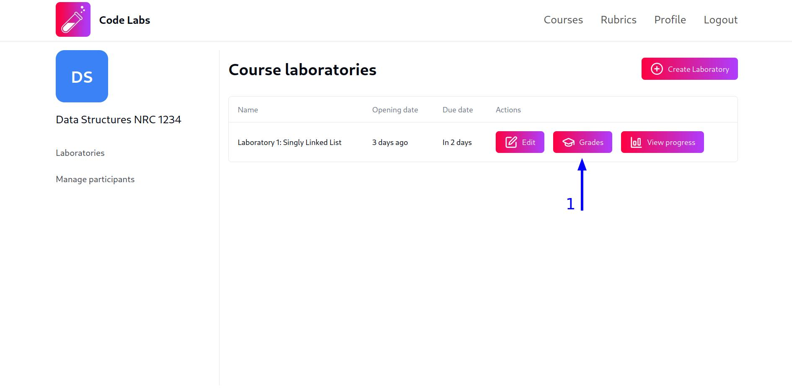
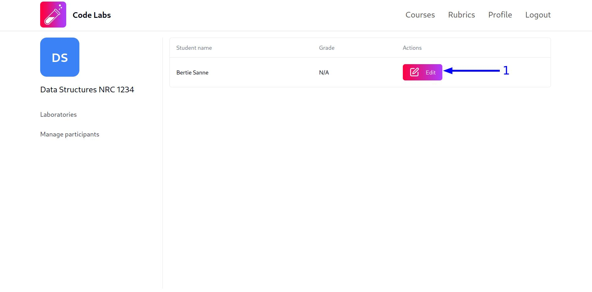
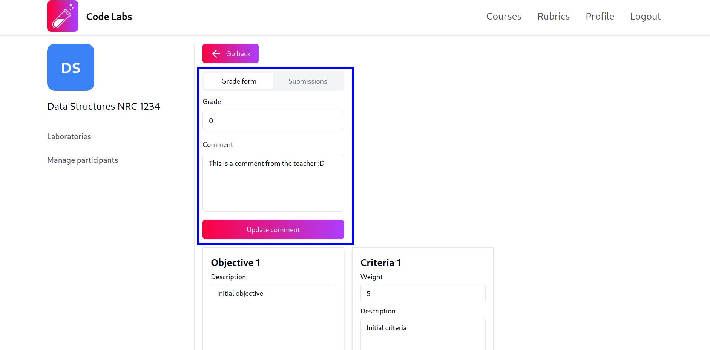
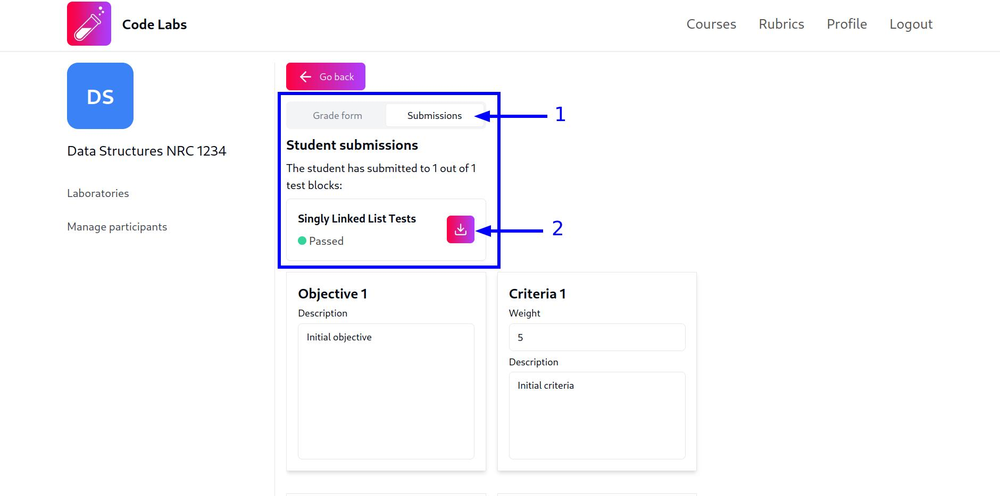
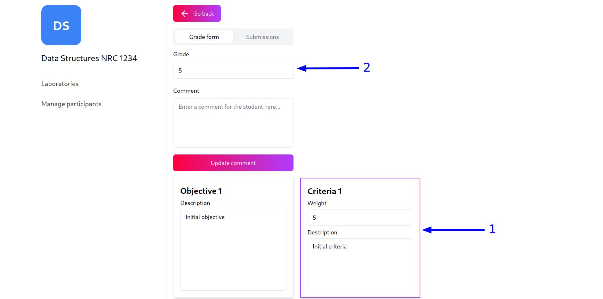
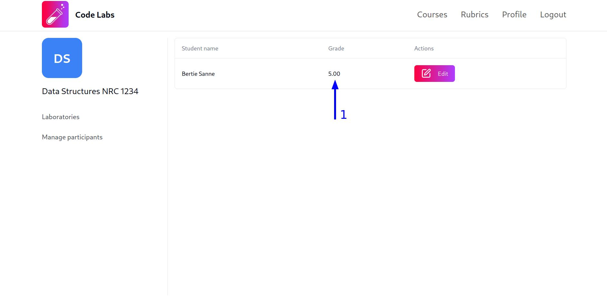

Antes de comenzar, ten en cuenta que, en la plataforma Code Labs, los profesores únicamente pueden calificar a los estudiantes en sus laboratorios si previamente han asignado una `rúbrica` al `laboratorio` correspondiente. Esto con el fin de que las calificaciones sean más transparentes y los estudiantes puedan comprender qué se espera de ellos en cada laboratorio.

Si necesitas conocer cómo crear una rúbrica, puedes consultar la [guía de creación de rúbricas](/manual/guides/teachers/rubrics-management/#crear-una-nueva-r%C3%BAbrica) y si deseas saber cómo asignar una rúbrica a un laboratorio, puedes consultar la [guía para editar la información de laboratorios](/manual/guides/teachers/laboratories-management#editar-la-informaci%C3%B3n-del-laboratorio).

## Calificar laboratorios

Para modificar las notas de los estudiantes en un laboratorio, sigue estos pasos:

1. Haz clic en el botón `Grades` del laboratorio en el que deseas calificar a los estudiantes:

2. Una vez hayas hecho clic en el botón, serás redirigido a una vista que contiene una tabla con la nota de cada estudiante en el laboratorio. En esta vista, el texto `N/A` indica que no has calificado al estudiante. Para calificar a un estudiante, haz clic en el botón `Edit` de la fila correspondiente al estudiante que deseas calificar:

3. Al hacer clic en el botón `Edit`, será redirigido a una vista que contiene, en primer lugar, una sección con las pestañas `Grade form` y `Submissions`. En la pestaña `Grade form`, encontrarás un formulario con los campos `Grade` y `Comment`. Ten en cuenta que el campo `Grade` **NO** es editable, ya que la nota del estudiante es calculada automáticamente a partir de los criterios seleccionados de la rúbrica (lo cual se explicará más adelante). Sin embargo, puedes agregar un comentario al estudiante si lo deseas:

:::caution
El comentario que agregues al estudiante **NO** se guardará automáticamente, deberás hacer clic en el botón `Update comment` para guardar los cambios.
:::

Por otra parte, en la pestaña `Submissions`, encontrarás una lista con las soluciones que el estudiante ha enviado a los diferentes bloques de pruebas del laboratorio. Si deseas descargar el código enviado por el estudiante, puedes hacer clic en el botón con el icono de descarga:

4. Finalmente, para calificar al estudiante, simplemente tienes que hacer clic en la tarjeta del criterio que deseas seleccionar. **NO** es necesario hacer clic en el botón `Update comment` para guardar los cambios, ya que la nota del estudiante se actualiza automáticamente al seleccionar un criterio y **el botón mencionado únicamente guarda los cambios realizados en el comentario**.

Los criterios seleccionados se destacarán con un borde de color morado y el campo `Grade` mostrará la sumatoria de las notas de los criterios seleccionados. Si deseas deshacer la selección de un criterio, simplemente haz clic nuevamente en la tarjeta del criterio.

:::note
Solo es posible seleccionar un criterio por cada objetivo de la rúbrica. Si, habiendo seleccionado un criterio para un objetivo, seleccionas otro criterio para el mismo objetivo, la selección anterior se desmarcará automáticamente y se seleccionará el nuevo criterio, actualizando la nota del estudiante acorde a la nueva selección.
:::

Luego de seleccionar los criterios que desees, al regresar a la vista de la tabla de calificaciones, podrás ver que la nota del estudiante ha sido actualizada automáticamente y el texto `N/A` ha sido reemplazado por la nota calculada a partir de los criterios seleccionados:

