## Crear un nuevo laboratorio

Una vez que hayas iniciado sesión en la plataforma, serás redirigido a la vista de los cursos que has creado. Para crear un nuevo laboratorio, sigue estos pasos:

1. Ingresa a la vista del curso en el que deseas crear el laboratorio haciendo clic en la tarjeta del curso:

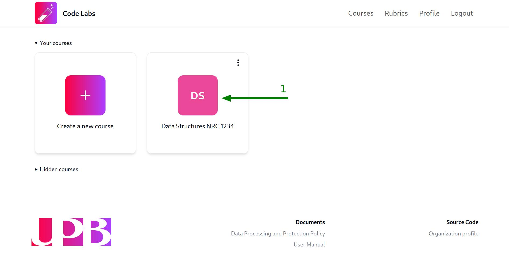

Por defecto, serás redirigido a la pestaña `Laboratories` de la vista del curso. Si no es así, haz clic en la pestaña `Laboratories` en la barra lateral de la vista del curso para acceder a la vista de los laboratorios:

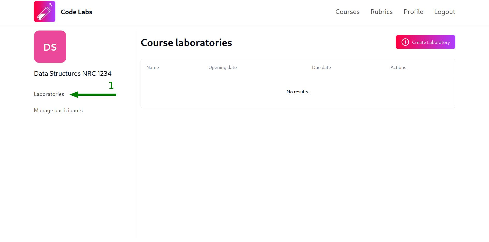

2. Haz clic en el botón `Create laboratory`:

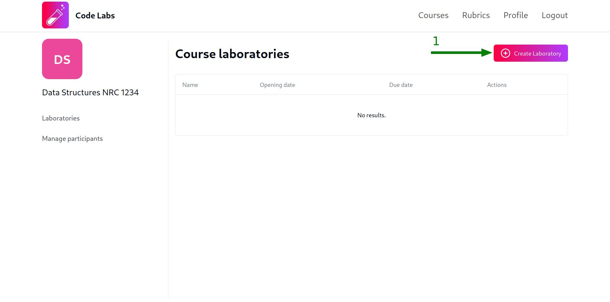

3. Completa el modal con el nombre del laboratorio y las fechas de apertura y cierre del laboratorio. Te sugerimos que uses un nombre lo suficientemente descriptivo para que tus estudiantes puedan identificar fácilmente el laboratorio, un buen ejemplo sería `Laboratory 1: Singly Linked List`. Una vez que hayas ingresado el nombre y las fechas, haz clic en el botón `Create`:

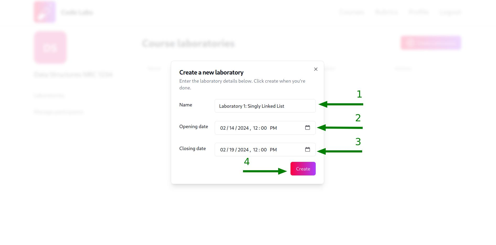

:::note
Las fechas de apertura y cierre usan la zona horaria `UTC -5`, es decir, la zona horaria de `Colombia`. Esto no puede ser cambiado y siempre se usará la misma zona horaria, independientemente de la zona horaria en la que te encuentres.

Una vez se alcance la fecha de cierre del laboratorio, los estudiantes podrán seguir viendo el contenido del laboratorio pero **NO** podrán enviar nuevas soluciones a los bloques de pruebas.
:::

:::tip
Si deseas crear un laboratorio que esté abierto hasta un día específico **a medianoche**, por ejemplo, el 14 de febrero de 2024, debes establecer la fecha de cierre al 15 de febrero de 2024 a las 12:00 AM (Equivalente a 00:00 AM).

Si eliges el 14 de febrero de 2024 a las 12:00 PM, el laboratorio cerrará al mediodía de ese día, y si eliges el 14 de febrero de 2024 a las 12:00 AM (Equivalente a 00:00 AM), el laboratorio cerrará al inicio (madrugada) de ese día en lugar del final (medianoche).
:::

Una vez que hayas creado el laboratorio, aparecerá una notificación verde en la esquina inferior derecha de la pantalla, confirmando que el laboratorio se ha creado correctamente y aparecerá una nueva fila en la tabla de laboratorios con el nombre del laboratorio, las fechas de apertura y cierre en formato legible para humanos y botones para ejecutar acciones sobre el laboratorio.

## Editar un laboratorio

Para ingresar a la vista del laboratorio y editar su contenido, haz clic en el botón `Edit` del laboratorio que deseas editar:

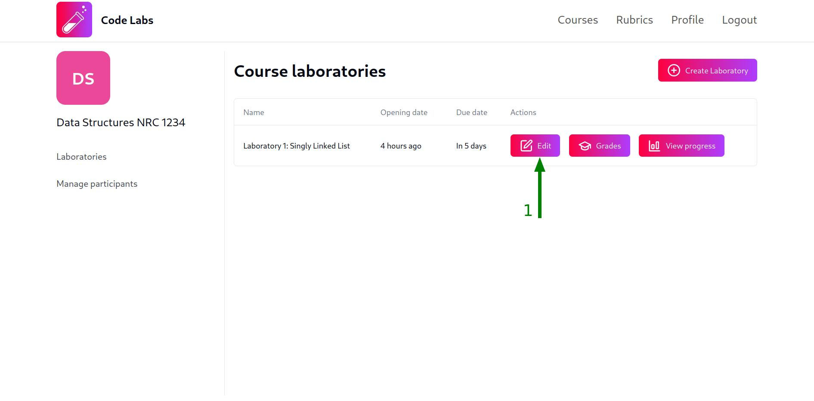

Una vez que hayas hecho clic en el botón `Edit`, serás redirigido a la vista del laboratorio, donde podrás editar la información y el contenido del laboratorio.

### Editar la información del laboratorio

La información básica del laboratorio incluye el nombre del laboratorio, las fechas de apertura y cierre y la rúbrica asignada al laboratorio.

En la parte superior de la vista del laboratorio, encontrarás la información que ingresaste al crear el laboratorio y un selector para asignar una rúbrica al laboratorio. Modifica la información que desees cambiar y haz clic en el botón `Save changes`:

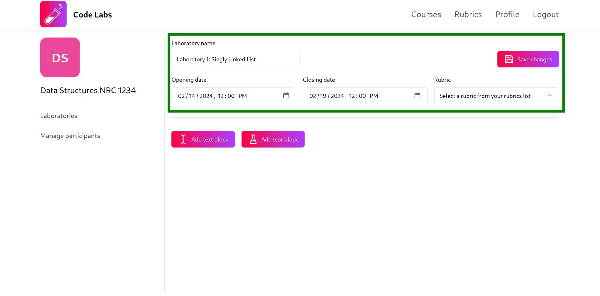

:::caution
Los cambios realizados en la información del laboratorio **NO SE GUARDARÁN** automáticamente, debes hacer clic en el botón `Save changes` para confirmar los cambios.
:::

### Editar el contenido del laboratorio

Antes de aprender a editar el contenido del laboratorio, debes saber que un laboratorio está compuesto por un conjunto de instrucciones escritas en `MarkDown` a través de `Text Blocks` y un conjunto de pruebas unitarias para evaluar las soluciones de los estudiantes a través de `Test Blocks`. Puedes agregar tantas instrucciones y pruebas unitarias como necesites.

#### Agregar un bloque de texto

Para agregar un nuevo bloque de texto, haz clic en el botón `Add text block` debajo del último bloque del laboratorio (Puede que necesites desplazarte hacia abajo para encontrarlo si tienes muchos bloques):

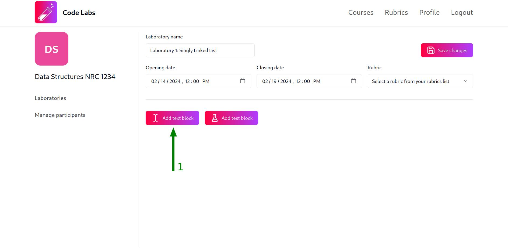

Una vez que hayas hecho clic en el botón `Add text block`, aparecerá una notificación verde en la esquina inferior derecha de la pantalla, confirmando que el bloque de texto se ha agregado correctamente y aparecerá un nuevo bloque de texto vacío en la vista del laboratorio para que puedas comenzar a escribir tus instrucciones.

Ten en cuenta que los bloques de texto están compuestos por un tooltip (1) con accesos directos para editar el contenido en `MarkDown` (Agregar imágenes, tablas, enlaces, etc.), un editor de `MarkDown` (2) y una vista previa del contenido en `MarkDown` (3):

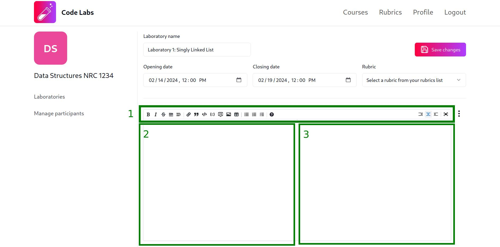

:::tip
Si no estás familiarizado con `MarkDown`, puedes aprender más sobre él en la [Guía de MarkDown](https://www.markdownguide.org/) o buscar cualquier otra guía en internet ya que es un lenguaje de marcado ampliamente utilizado.
:::

#### Editar un bloque de texto

Puedes editar el contenido de un bloque de texto directamente en el editor de `MarkDown`. Para guardar los cambios, haz clic en el menú desplegable del bloque de texto (los tres puntos en la esquina superior derecha del bloque) y selecciona la opción con el texto `Save changes`:

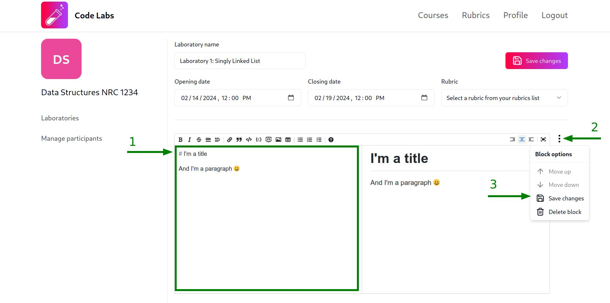

:::caution
Los cambios realizados en el contenido del bloque de texto **NO** se guardarán automáticamente, debes hacer clic en el botón `Save changes` para confirmar los cambios.
:::

#### Eliminar un bloque de texto

Para eliminar un bloque de texto, haz clic en el menú desplegable del bloque de texto (los tres puntos en la esquina superior derecha del bloque) y selecciona la opción con el texto `Delete block`:

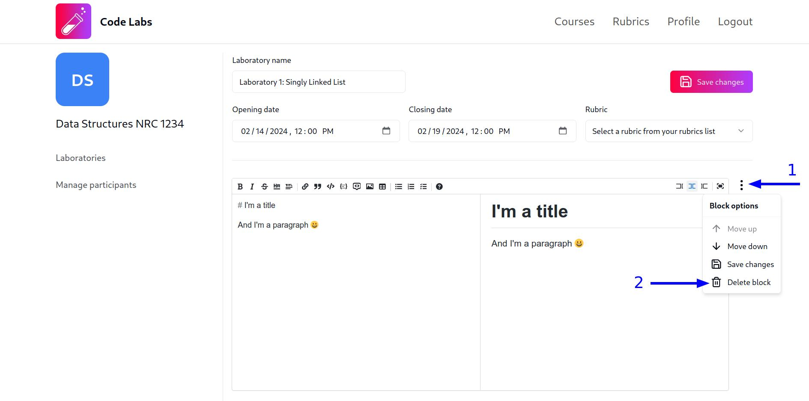

Una vez que hayas hecho clic en el botón `Delete block`, aparecerá un modal de confirmación. Haz clic en el botón `Delete` para confirmar que deseas eliminar el bloque de texto o haz clic en el botón `Cancel` si deseas cancelar la operación:

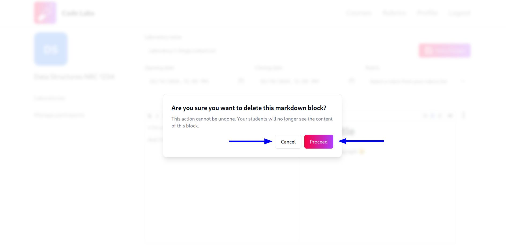

#### Agregar un bloque de pruebas

Para agregar un nuevo bloque de pruebas, haz clic en el botón `Add test block` debajo del último bloque del laboratorio (Puede que necesites desplazarte hacia abajo para encontrarlo si tienes muchos bloques):

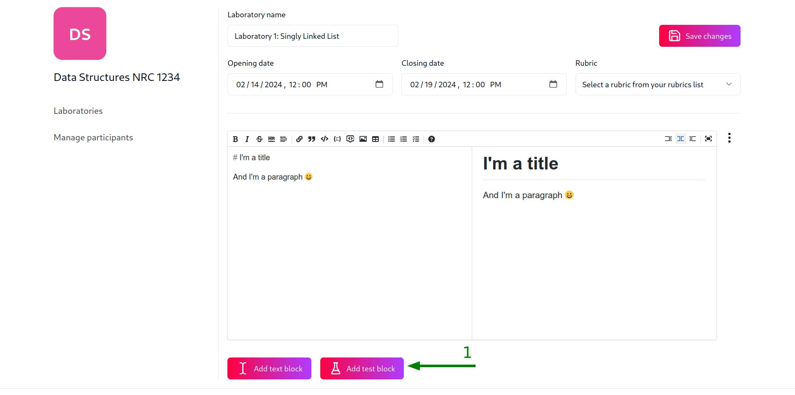

Una vez que hayas hecho clic en el botón `Add test block`, tendrás que llenar el modal con el nombre del bloque de pruebas, seleccionar un lenguaje de programación de la lista de lenguajes soportados y subir un archivo `zip` que contenga las pruebas para evaluar las soluciones de los estudiantes. Una vez que hayas llenado la información, haz clic en el botón `Add`:

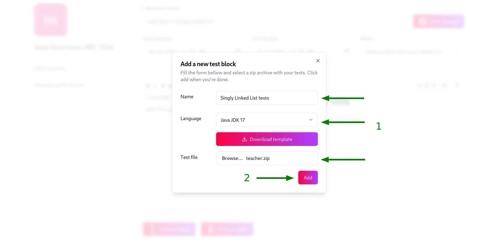

Ten en cuenta que, después de seleccionar un lenguaje de programación en la lista de lenguajes soportados, el modal te mostrará un botón para descargar un archivo `zip` con el template para escribir las pruebas en el lenguaje seleccionado. **DEBES** usar este template para escribir las pruebas ya que **NO** podemos garantizar que las pruebas funcionarán si usas una estructura de carpetas, librerías o cualquier otra cosa que no esté soportada por nuestro template.

Además, cada bloque de pruebas tiene un botón para descargar el archivo `zip` con las pruebas que subiste y otro botón para descargar el archivo `zip` con el template para escribir las pruebas en el lenguaje seleccionado:

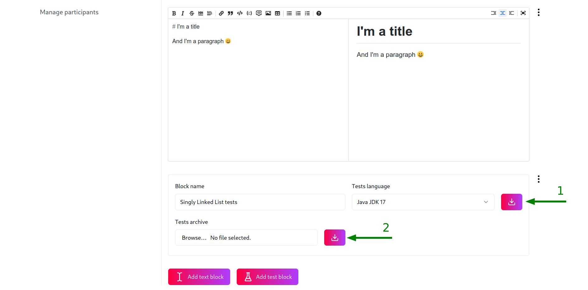

##### Consideraciones especiales para los lenguajes soportados

Por favor, lee las guías específicas para cada lenguaje soportado para conocer más sobre las consideraciones específicas que debes tener en cuenta al escribir las pruebas en cada lenguaje:

- [JAVA](/guides/teachers/languages-specific-considerations/java/)

#### Editar un bloque de pruebas

En cualquier momento puedes renombrar los bloques de prueba, cambiar el lenguaje de programación o cambiar el archivo `zip` con las pruebas a ejecutar. Puedes hacer las modificaciones directamente en el bloque de pruebas y guardar los cambios haciendo clic en el botón `Save changes` del menú desplegable del bloque de pruebas:

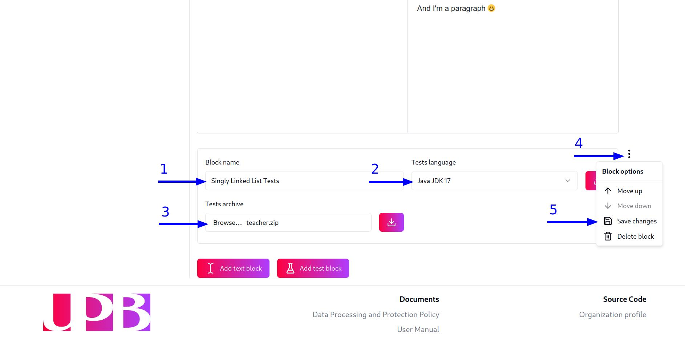

#### Eliminar un bloque de pruebas

Para eliminar un bloque de pruebas, haz clic en el menú desplegable del bloque de pruebas (los tres puntos en la esquina superior derecha del bloque) y selecciona la opción con el texto `Delete block`:

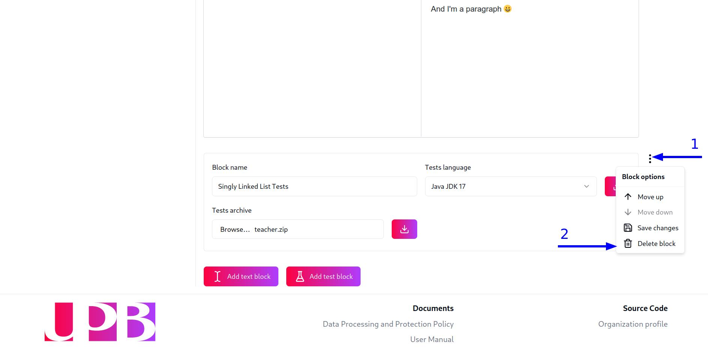

Una vez que hayas hecho clic en el botón `Delete block`, aparecerá un modal de confirmación. Haz clic en el botón `Delete` para confirmar que deseas eliminar el bloque de pruebas o haz clic en el botón `Cancel` si deseas cancelar la operación:

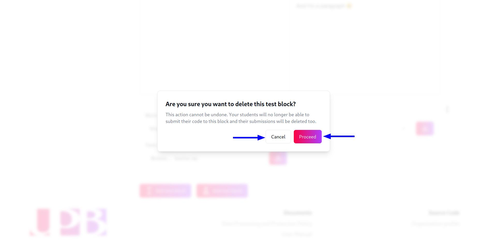

:::caution
Si eliminas un bloque de pruebas, **TODAS** las soluciones de los estudiantes que hayan sido enviadas a ese bloque de pruebas **TAMBIÉN** serán eliminadas para ahorrar espacio en el servidor y **NO** podrán ser recuperadas.
:::

#### Intercambiar la posición de los bloques

Puedes mover los bloques de texto y pruebas hacia arriba o hacia abajo para cambiar su posición en el laboratorio. Para hacerlo, haz clic en el menú desplegable del bloque que deseas mover (los tres puntos en la esquina superior derecha del bloque) y selecciona la opción con el texto `Move up` o `Move down`:

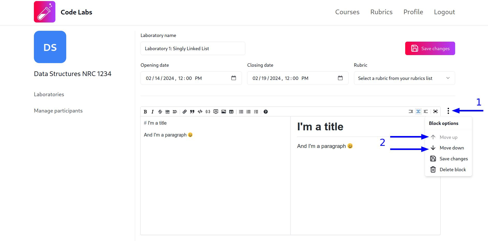

:::note
No es posible mover hacia arriba el primer bloque del laboratorio ni mover hacia abajo el último bloque del laboratorio ya que no hay un bloque anterior o posterior con el cual intercambiar la posición.
:::

## Monitorear un laboratorio

Para monitorear el progreso de los estudiantes en un laboratorio, haz clic en el botón `View progress` del laboratorio que deseas monitorear en la tabla de laboratorios:

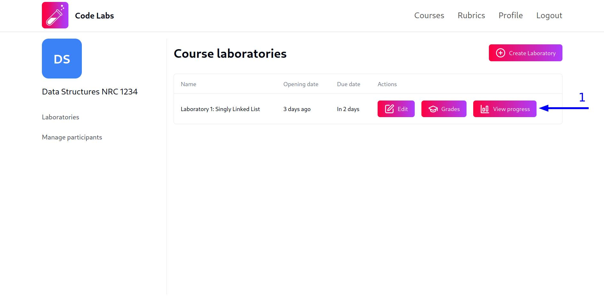

Una vez que hayas hecho clic en el botón `View progress`, serás redirigido a la vista de progreso del laboratorio, donde podrás tres gráficos que muestran el progreso de los estudiantes en el laboratorio.

El primer gráfico es un gráfico de barras horizontal cuyo eje `X` representa cuántas pruebas (bloques de prueba) han sido completadas, han fallado, están siendo ejecutadas o están pendientes de ejecución y cuyo eje `Y` contiene el nombre de cada estudiante:

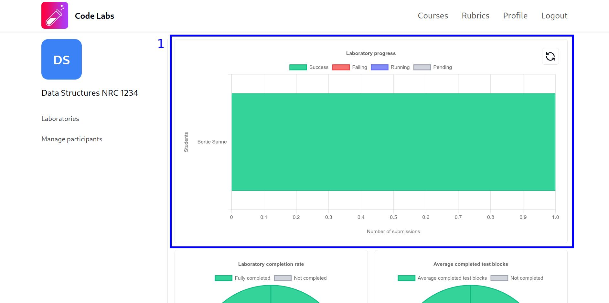

Si requieres actualizar la información, puedes hacer clic en el botón con el icono de recargar en la esquina superior derecha del gráfico.

El segundo y tercer gráfico son gráficos de dona que muestran el porcentaje de estudiantes que han completado todas las pruebas (bloques de prueba) y el promedio de pruebas completadas por los estudiantes, respectivamente:

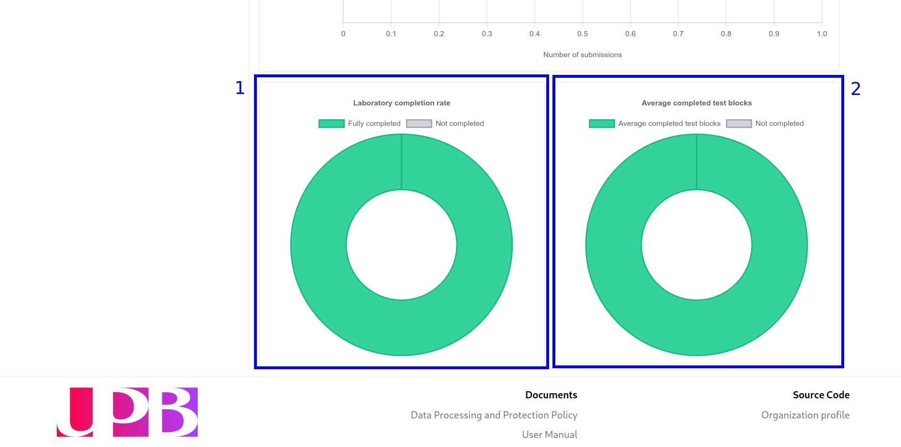
