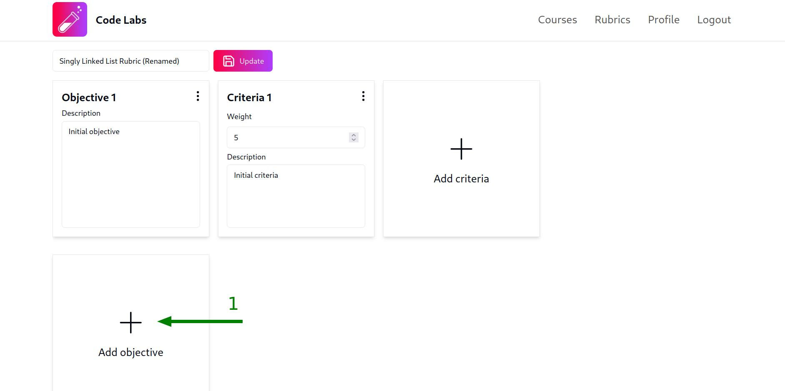

## Crear una nueva rúbrica

Una vez que hayas iniciado sesión en la plataforma, puedes acceder a la vista de rúbricas haciendo clic en la pestaña `Rubrics` en la barra de navegación superior. Una vez allí, sigue estos pasos para crear una nueva rúbrica:

1. Haz clic en el botón `Create rubric`:

2. Ingresa el nombre de la rúbrica en el modal. Te sugerimos que uses un nombre lo suficientemente descriptivo para que puedas identificar fácilmente la rúbrica. Una vez que hayas ingresado el nombre, haz clic en el botón `Create`:

Una vez que hayas creado la rúbrica, aparecerá una notificación verde en la esquina inferior derecha de la pantalla, confirmando que la rúbrica se ha creado correctamente y aparecerá una nueva fila en la tabla de rúbricas con el nombre de la rúbrica y botones para editarla y eliminarla:

## Editar una rúbrica

Para entrar en la vista de edición de una rúbrica, haz clic en el botón con el texto `Edit` en la fila de la rúbrica:

Una vez que hayas hecho clic en el botón `Edit`, serás redirigido a la vista de edición de la rúbrica. Aquí puedes renombrar la rúbrica y agregar, editar o eliminar sus objetivos y criterios.

:::note
Por defecto, la rúbrica tendrá un objetivo y un criterio de ejemplo. Puedes eliminarlos o actualizarlos según tus necesidades.
:::

### Renombrar una rúbrica

En la parte superior de la vista de edición de la rúbrica, encontrarás el campo para renombrar la rúbrica. Por defecto, valor del campo será nombre actual de la rúbrica, puedes cambiarlo y luego hacer clic en el botón `Update` para confirmar los cambios:

:::caution
Los cambios realizados al nombre de la rúbrica **NO** se guardarán automáticamente, debes hacer clic en el botón `Update` para confirmar los cambios.
:::

### Agregar un objetivo

Las rúbricas están compuestas por objetivos que a su vez están compuestos por criterios. En la vista de edición de la rúbrica, cada objetivo y sus criterios se mostrarán como una fila de tarjetas. La primera tarjeta será el objetivo y las siguientes tarjetas serán los criterios del objetivo. Para agregar un nuevo objetivo, sigue estos pasos:

1. Haz clic en el botón `Add objective` que se encuentra debajo de la última fila de objetivos:

2. Completa el modal con la descripción del objetivo y haz clic en el botón `Create`. Te sugerimos que, como es usual, incluyas las respuestas a las preguntas `Qué`, `Cómo` y `Para qué` en la descripción del objetivo para que este sea lo más claro posible para los estudiantes:

Una vez que hayas creado el objetivo, aparecerá una notificación verde en la esquina inferior derecha de la pantalla, confirmando que el objetivo se ha creado correctamente y aparecerá una nueva fila con la tarjeta del objetivo y un botón para añadir criterios al objetivo:

:::note
Los objetivos no tienen un peso o nota ya que solo son usados para agrupar criterios. Para calificar las entregas de los estudiantes, se usa el peso de los criterios.
:::

### Editar un objetivo

Puedes editar la descripción de un objetivo directamente en la tarjeta del objetivo. Para guardar los cambios haz clic en el menú desplegable de la tarjeta del objetivo (los tres puntos en la esquina superior derecha de la tarjeta) y selecciona la opción con el texto `Save changes`:

:::caution
Los cambios realizados a la descripción del objetivo **NO** se guardarán automáticamente, debes hacer clic en el botón `Save changes` para confirmar los cambios.
:::

### Eliminar un objetivo

Para eliminar un objetivo, haz clic en el menú desplegable de la tarjeta del objetivo (los tres puntos en la esquina superior derecha de la tarjeta) y selecciona la opción con el texto `Delete objective`:

Después de eso, aparecerá un modal preguntándote si deseas confirmar la eliminación del objetivo. Haz clic en el botón `Proceed` para confirmar la eliminación o haz clic en el botón `Cancel` para cancelar la acción:

:::caution
Una vez que hayas eliminado un objetivo, no podrás recuperarlo. Todos los criterios del objetivo también serán eliminados y las notas de los estudiantes en las que se estuvieran usando los criterios del objetivo serán calculadas nuevamente de forma automática.
:::

### Agregar un criterio

Para agregar un nuevo criterio a un objetivo, sigue estos pasos:

1. Haz clic en el botón `Add criteria` al final de la fila del objetivo (Puede que necesites desplazarte hacia la derecha para ver el botón si el objetivo tiene muchos criterios):

2. Completa el modal con la descripción y el peso del criterio:

:::note
Recuerda que el peso del criterio se usará para calificar las entregas de los estudiantes, puedes usar cualquier número entre `0` y `100`, incluyendo decimales con hasta 6 dígitos de precisión.
:::

Una vez que hayas creado el criterio, aparecerá una notificación verde en la esquina inferior derecha de la pantalla, confirmando que el criterio se ha creado correctamente y se añadirá una tarjeta con la descripción y el peso del criterio a la fila del objetivo en la vista de edición de la rúbrica:

### Editar un criterio

Al igual que con los objetivos, puedes editar la descripción y el peso de un criterio directamente en la tarjeta del criterio. Para guardar los cambios haz clic en el menú desplegable de la tarjeta del criterio (los tres puntos en la esquina superior derecha de la tarjeta) y selecciona la opción con el texto `Save changes`:

:::caution
Los cambios realizados a la descripción y el peso del criterio **NO** se guardarán automáticamente, debes hacer clic en el botón `Save changes` para confirmar los cambios.
:::

### Eliminar un criterio

Para eliminar un criterio, haz clic en el menú desplegable de la tarjeta del criterio (los tres puntos en la esquina superior derecha de la tarjeta) y selecciona la opción con el texto `Delete criteria`:

Después de eso, aparecerá un modal preguntándote si deseas confirmar la eliminación del criterio. Haz clic en el botón `Proceed` para confirmar la eliminación o haz clic en el botón `Cancel` para cancelar la acción:

:::caution
Una vez que hayas eliminado un criterio, no podrás recuperarlo. Las notas de los estudiantes en las que se estuviera usando el criterio serán calculadas nuevamente de forma automática.
:::

## Eliminar una rúbrica

Para eliminar una rúbrica, haz clic en el botón `Delete` en la fila de la rúbrica:

Después de eso, aparecerá un modal preguntándote si deseas confirmar la eliminación de la rúbrica. Haz clic en el botón `Proceed` para confirmar la eliminación o haz clic en el botón `Cancel` para cancelar la acción:

:::caution
Una vez que hayas eliminado una rúbrica, no podrás recuperarla. Todas las notas de los estudiantes calculadas a partir de la rúbrica serán eliminadas también y los laboratorios en los que la rúbrica estaba asignada serán actualizados para no usar ninguna rúbrica.
:::
