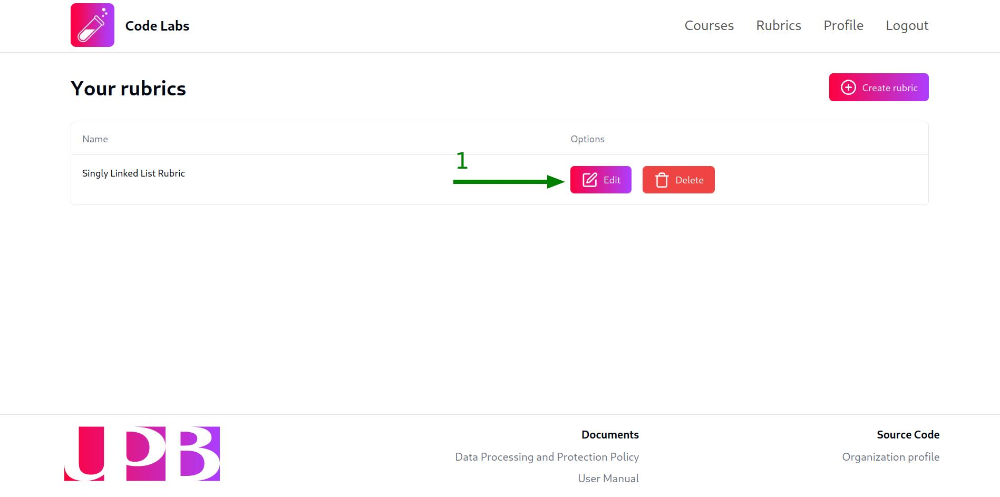

## Create a new rubric

Once you have logged in to the platform, you can access the rubrics view by clicking on the `Rubrics` tab in the top navigation bar.

To create a new rubric, follow these steps:

1. Click on the `Create rubric` button:

2. Fill in the modal with the rubric's name. We suggest you to use a descriptive enough name so that you can easily identify the rubric. Once you have filled in the name, click on the `Create` button:

Once you have created the rubric, a green notification will appear at the right-bottom corner of the screen, confirming that the rubric has been created successfully and a row with the rubric's name and the actions to edit and delete it will appear in the rubrics table:

## Edit a rubric

To enter into the rubric's edition view, click on the button with the `Edit` label in the rubric's row:

Once you have clicked on the `Edit` button, you will be redirected to the rubric's edition view. Here you can rename the rubric and add, edit and delete the objectives and criteria of the rubric.

:::note
By default, the rubric will have a single objective and a single criteria. You can remove or update them as you need.
:::

### Rename a rubric

At the top of the rubric's edition view, you will find the input to rename the rubric. By default, the input will be filled with the current name of the rubric, you can change it and then click on the `Update` button to confirm the changes:

:::caution
Changes made to the rubric's name **WILL NOT** be saved automatically, you need to click on the `Update` button to confirm the changes.
:::

### Add an objective

Rubrics are composed of objectives which are composed of criteria. In the rubric's edition view, each objective and its criteria will be displayed as a row of cards. The first card will be the objective and the following cards will be the criteria of the objective.

To add a new objective, follow these steps:

1. Click on the `Add objective` button above the last objective's row:

2. Fill in the modal with the objective's description and click on the `Create` button. We suggest you to include the answers to the `What`, `How` and `Why` questions in the description of the objective to make it clear for the students:

Once you have created the objective, a green notification will appear at the right-bottom corner of the screen, confirming that the objective has been created successfully and a row with the objective's card and a button to add criteria to it will appear in the rubric's edition view:

:::note
Objectives do not have a weight, they are just a way to group criteria. The weight of the criteria will be used to grade the students' submissions.
:::

### Edit an objective

You can edit the description of an objective directly in the objective's card. To save the changes, click click on the dropdown menu of the objective's card (the three dots at the top-right corner of the card) and select the option with the `Save changes` label:

:::caution
Changes made to the objective's description **WILL NOT** be saved automatically, you need to click on the `Save changes` button to confirm the changes.
:::

### Delete an objective

To delete an objective, click on the dropdown menu of the objective's card (the three dots at the top-right corner of the card) and select the option with the `Delete objective` label:

After that, a modal will appear asking you to confirm the deletion of the objective. Click on the `Proceed` button to confirm the deletion or click on the `Cancel` button to not delete the objective:

:::caution
Once you have deleted an objective, you will not be able to recover it. All the criteria of the objective will be deleted as well and the grades of the students' submissions that were using any of the criteria of the objective will be recalculated accordingly.
:::

### Add a criteria

To add a new criteria to an objective, follow these steps:

1. Click on the `Add criteria` button at the end of the objective's row (You may need to scroll to the right to see the button if the objective has many criteria):

2. Fill in the modal with the criteria's description and weight:

:::note
Remember that the weight of the criteria will be used to grade the students' submissions, you can use any number between `0` and `100`, including decimals with up to 6 digits of precision.
:::

Once you have created the criteria, a green notification will appear at the right-bottom corner of the screen, confirming that the criteria has been created successfully and a card with the criteria's description and weight will be added to the objective's row in the rubric's edition view:

### Edit a criteria

You can edit the description and weight of a criteria directly in the criteria's card. To save the changes, click click on the dropdown menu of the criteria's card (the three dots at the top-right corner of the card) and select the option with the `Save changes` label:

:::caution
Changes made to the criteria's description and weight **WILL NOT** be saved automatically, you need to click on the `Save changes` button to confirm the changes.
:::

### Delete a criteria

To delete a criteria, click on the dropdown menu of the criteria's card (the three dots at the top-right corner of the card) and select the option with the `Delete criteria` label:

After that, a modal will appear asking you to confirm the deletion of the criteria. Click on the `Proceed` button to confirm the deletion or click on the `Cancel` button to not delete the criteria:

:::caution
Once you have deleted a criteria, you will not be able to recover it. The grades of the students' submissions that were using the criteria will be recalculated accordingly.
:::

## Delete a rubric

To delete a rubric, click on the `Delete` button in the rubric's row:

After that, a modal will appear asking you to confirm the deletion of the rubric. Click on the `Proceed` button to confirm the deletion or click on the `Cancel` button to not delete the rubric:

:::caution
Once you have deleted a rubric, you will not be able to recover it. All the grades of the students' submissions that were using the rubric will be lost and the laboratories that were using the rubric will be updated to not use any rubric.
:::
