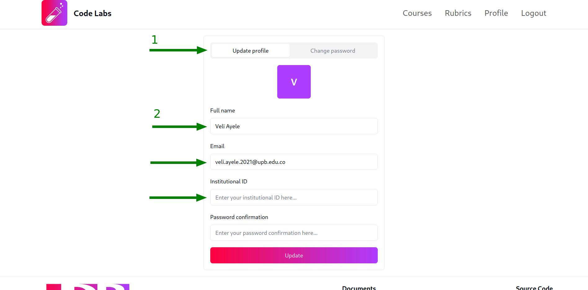
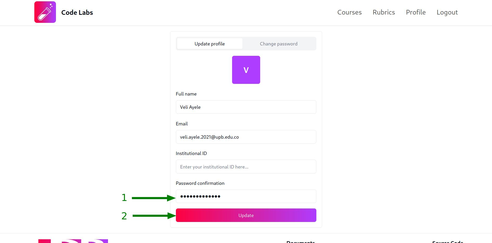
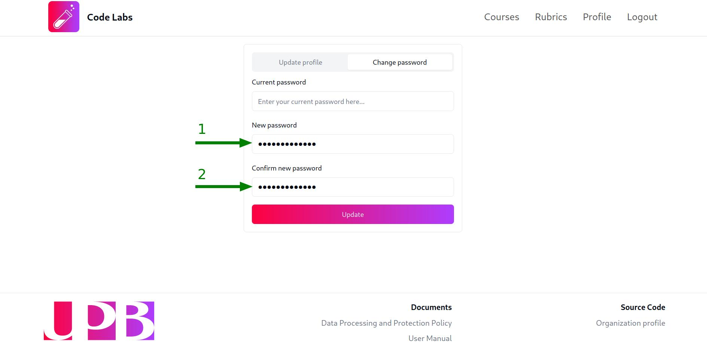
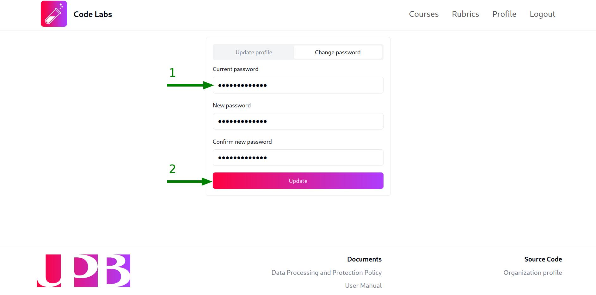

## Update profile information

Once you have logged in to the platform, you can access your profile view by clicking on the `Profile` tab in the top navigation bar.

To update your profile information, follow these steps:

1. Click on the `Update profile` tab (active by default) and fill in the form with the new information you want to update:

:::note
Keep in mind that:

- All the users can update their `Full name` and `Email` fields.

- Only students can update their `Institutional ID` field. In the case of `admins` and `teachers`, the field will be empty since it is not required for them.

- `students`'s and `teachers`'s `Email` field must end with the `UPB` domain, otherwise, the form validation will fail.
  :::

2. Once you have filled in the form, you will also need to fill in the `Password confirmation` field with your current password to confirm the changes in order to prevent unauthorized changes. After that, click on the `Update` button:

After that, a green notification will appear at the right-bottom corner of the screen, confirming that the profile information has been updated successfully or a red notification will appear if the credentials were incorrect or any other error occurred.

## Change password

To change your password, follow these steps:

1. Click on the `Change password` tab and fill in the `New password` and `Confirm new password` fields with the new password you want to use:

2. Once you have filled in the form, you will also need to fill in the `Current password` field with your current password to confirm the changes in order to prevent unauthorized changes. After that, click on the `Change` button:

After that, a green notification will appear at the right-bottom corner of the screen, confirming that the password has been changed successfully or a red notification will appear if the credentials were incorrect or any other error occurred.
